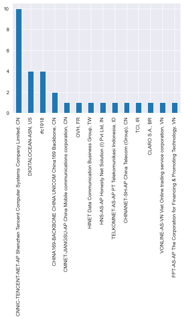
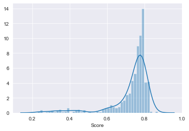

# RITA Scripts
Thanks to Active Countermeasures RITA Tool for Zeek/Bro

- https://github.com/activecm/rita
- https://github.com/zeek


 Here are a collection of scripts to make it easier to extract more intelligence from RITA output.


### Finding the AS number of hosts with high beacon scores
- doing reverse lookups on the beacons is a pain and often doesn't return anything interesting. 
- This is a quick script to let you narrow down beaconish originators using the AS number, which is more stable.

As in this example many things that look beaconish are actually DNS calls or Corporate Services. 


```
for x in `rita show-beacons myhost|grep -v Source |awk -F, '{if ($1 > .8) print $3}'`; do echo "$x: $(whois -h whois.cymru.com " -v $x"| grep -v BGP)"; done
8.8.8.8: 15169   | 8.8.8.8          | 8.8.8.0/24          | US | arin     | 1992-12-01 | GOOGLE, US
208.67.222.222: 36692   | 208.67.222.222   | 208.67.222.0/24     | US | arin     | 2006-06-06 | OPENDNS, US
17.57.144.181: 714     | 17.57.144.181    | 17.57.144.0/22      | US | arin     | 1990-04-16 | APPLE-ENGINEERING, US
198.252.206.25: 25791   | 198.252.206.25   | 198.252.206.0/24    | US | arin     | 2012-10-17 | SE-NET, US
52.38.194.37: 16509   | 52.38.194.37     | 52.36.0.0/14        | US | arin     | 2015-09-02 | AMAZON-02, US
172.217.14.227: 15169   | 172.217.14.227   | 172.217.14.0/24     | US | arin     | 2012-04-16 | GOOGLE, US
17.57.144.181: 714     | 17.57.144.181    | 17.57.144.0/22      | US | arin     | 1990-04-16 | APPLE-ENGINEERING, US
17.57.144.180: 714     | 17.57.144.180    | 17.57.144.0/22      | US | arin     | 1990-04-16 | APPLE-ENGINEERING, US
34.214.241.122: 16509   | 34.214.241.122   | 34.208.0.0/12       | US | arin     | 2016-09-12 | AMAZON-02, US
52.37.150.23: 16509   | 52.37.150.23     | 52.36.0.0/14        | US | arin     | 2015-09-02 | AMAZON-02, US
35.165.114.190: 16509   | 35.165.114.190   | 35.160.0.0/13       | US | arin     | 2016-08-09 | AMAZON-02, US
54.244.7.161: 16509   | 54.244.7.161     | 54.244.0.0/18       | US | arin     | 2011-12-09 | AMAZON-02, US
216.58.193.67: 15169   | 216.58.193.67    | 216.58.192.0/22     | US | arin     | 2012-01-27 | GOOGLE, US
...
```

## Notebooks
### Exporatory Data Analysis of extrnal traffic

- What AS Regions are generating the most connections?  


- What is the relative number of high percentage beaconish activity?  

